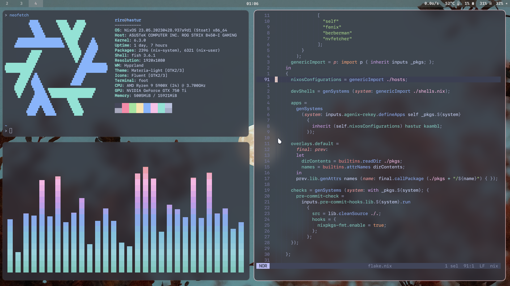

  

# Nix flake

This repo contains declaritive configuration of few NixOS system, with ~100% config Nixfied.

[简体中文](./README_zh_CN.md)

with:

+ [agenix](https://github.com/ryantm/agenix) & [rekey](https://github.com/oddlama/agenix-rekey), keys are not stored on disk, dec & enc with yubikey.
+ [lanzaboote](https://github.com/nix-community/lanzaboote) implements secure boot.
+ root on tmpfs, keep states with [impermanence](https://github.com/nix-community/impermanence).
+ [home-manager](https://github.com/nix-community/home-manager) configurations as flake module.

---


<details><summary>misc</summary>



</details>

|Type|Program|
|---|---|
|Editor|[helix](https://github.com/oluceps/nixos-config/tree/main/home/programs/helix)|
|WM|[Hyprland](https://github.com/oluceps/nixos-config/tree/main/home/programs/hyprland)|
|Shell|[fish](https://github.com/oluceps/nixos-config/tree/main/home/programs/fish)|
|Bar|[waybar](https://github.com/oluceps/nixos-config/tree/main/home/programs/waybar)|
|Terminal|[foot](https://github.com/oluceps/nixos-config/tree/main/home/programs/foot)|
|backup|[btrbk](https://github.com/oluceps/nixos-config/tree/main/modules/btrbk)|  

__Overlay & nixosModules__  

This flake contains overlay and modules of few packages,

Applying:  

```nix
# flake.nix
{
  inputs.oluceps.url = "github:oluceps/nixos-config";
  outputs = inputs: {
    nixosConfigurations.machine-name = {
    # ...
    modules = [
      # ...
      {
        nixpkgs.overlays = [ inputs.oluceps.overlay ];
        # packages in `pkgs` dir of this repo,
        # with pname consist with dir name
        environment.systemPackages = [ pkgs.shadow-tls ];
      }

      inputs.oluceps.nixosModules.default
      # or any standalone module (see `nix flake show`)
    ];
  };
};
}
```


## References

Excellent configurations that I've learned and copied:  
+ [NickCao/flakes](https://github.com/NickCao/flakes)  
+ [ocfox/nixos-config](https://github.com/ocfox/nixos-config)  
+ [Clansty/flake](https://github.com/Clansty/flake)  
+ [fufexan/dotfiles](https://github.com/fufexan/dotfiles)  
+ [gvolpe/nix-config](https://github.com/gvolpe/nix-config)

---

+ [Erase your darlings](https://grahamc.com/blog/erase-your-darlings)  
+ [NixOS: tmpfs as root](https://elis.nu/blog/2020/05/nixos-tmpfs-as-root/)  
+ [How to Learn Nix](https://ianthehenry.com/posts/how-to-learn-nix/)  
+ [Attrset functions](https://ryantm.github.io/nixpkgs/functions/library/attrsets/)  
+ [Way to search function](http://noogle.dev)  
 
[NixOS-CN-telegram](https://github.com/nixos-cn/NixOS-CN-telegram)
