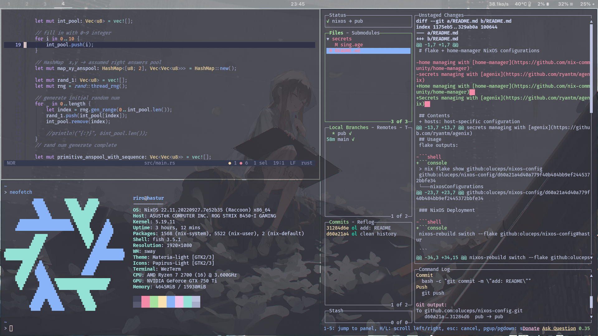

# flake + home-manager NixOS configurations

Home managing with [home-manager](https://github.com/nix-community/home-manager)  
Secrets managing with [agenix](https://github.com/ryantm/agenix)  


## Usage
__Before deployment, customizing `hardware.nix` and `network.nix`  in `./hosts/`__

You can replace hostname globally with:    
```console  
sed -i "s/hastur/YOUR_HOSTNAME/g" `rg -rl "hastur" ./`  
```

flake outputs:  

```console
> nix flake show github:oluceps/nixos-config
github:oluceps/nixos-config/d60a21a4d40a779f40b484bb9ef2445372bbfe34
└───nixosConfigurations
    ├───hastur: NixOS configuration
    └───kaambl: NixOS configuration
```  

### NixOS Deployment

```console
nixos-rebuild switch --flake github:oluceps/nixos-config#hastur
  
```
|Type|Program|
|---|---|
|Editor|[helix](https://github.com/oluceps/nixos-config/tree/pub/home/programs/helix)|
|WM|[sway](https://github.com/oluceps/nixos-config/tree/pub/home/programs/sway)|
|Shell|[fish](https://github.com/oluceps/nixos-config/tree/pub/home/programs/fish)|
|Bar|[waybar](https://github.com/oluceps/nixos-config/tree/pub/home/programs/waybar)|
|Terminal|[wezterm](https://github.com/oluceps/nixos-config/tree/pub/home/programs/wezterm)|


## Contents
+ hosts: host-specific configuration  
+ home: home-manager config  
+ modules: as its name  
+ modules/packs: self-packaged softwares


## Directory structure  
```console  
> tree
.
├── boot.nix
├── flake.lock
├── flake.nix
├── home
│   ├── default.nix
│   ├── home.nix
│   └── programs
│       ├── bspwm
│       │   ├── bspwmrc
│       │   ├── default.nix
│       │   └── sxhkdrc
│       ├── chrome
│       │   └── default.nix
│       ├── default.nix
│       ├── fish
│       │   └── default.nix
│       ├── helix
│       │   ├── config
│       │   │   ├── config.toml
│       │   │   ├── languages.toml
│       │   │   └── themes
│       │   │       └── catppuccin_macchiato.toml
│       │   └── default.nix
│       ├── kitty.nix
│       ├── nnn.nix
│       ├── nushell
│       │   ├── config.nu
│       │   ├── default.nix
│       │   └── env.nu
│       ├── ranger
│       │   └── default.nix
│       ├── starship.nix
│       ├── sway
│       │   └── default.nix
│       ├── waybar
│       │   ├── default.nix
│       │   └── waybar.css
│       └── wezterm
│           ├── catppuccin.lua
│           ├── default.nix
│           └── wezterm.lua
├── hosts
│   ├── default.nix
│   ├── hastur
│   │   ├── default.nix
│   │   ├── hardware.nix
│   │   └── network.nix
│   └── kaambl
│       ├── default.nix
│       ├── hardware.nix
│       └── network.nix
├── LICENSE
├── misc.nix
├── modules
│   ├── blog
│   │   └── default.nix
│   ├── clash-m
│   │   └── default.nix
│   ├── default.nix
│   ├── foot
│   │   └── foot.ini
│   ├── hyprland
│   │   ├── config.nix
│   │   └── default.nix
│   ├── hysteria
│   │   ├── config.nix
│   │   └── default.nix
│   ├── packs
│   │   ├── clash-m
│   │   │   └── default.nix
│   │   ├── clash-p
│   │   │   └── default.nix
│   │   ├── glowsans
│   │   │   └── default.nix
│   │   ├── Graphite-cursors
│   │   │   └── default.nix
│   │   ├── maple-font
│   │   │   └── default.nix
│   │   ├── opensk-udev-rules
│   │   │   └── default.nix
│   │   ├── plangothic
│   │   │   └── default.nix
│   │   ├── RustPlayer
│   │   │   └── default.nix
│   │   ├── san-francisco
│   │   │   └── default.nix
│   │   ├── sing-box
│   │   │   └── default.nix
│   │   └── v2ray-plugin
│   │       └── default.nix
│   ├── polybar
│   │   ├── config.ini
│   │   └── default.nix
│   ├── sing-box
│   │   └── default.nix
│   └── ss
│       └── default.nix
├── overlay.nix
├── packages.nix
├── README.md
├── screenshot.png
├── secrets
│   ├── secrets.nix
│   ├── sing.age
│   └── ssconf.age
├── services.nix
├── shell.nix
├── sysvars.nix
└── users.nix

38 directories, 71 files
```  

## Screenshot  



## Resources  
Excellent configurations that I've learned and copied:  
+ [NickCao/flakes](https://github.com/NickCao/flakes)  
+ [ocfox/nixos-config](https://github.com/ocfox/nixos-config)  
+ [Clansty/flake](https://github.com/Clansty/flake)  
+ [fufexan/dotfiles](https://github.com/fufexan/dotfiles)  
+ [gvolpe/nix-config](https://github.com/gvolpe/nix-config)

[NixOS-CN-telegram](https://github.com/nixos-cn/NixOS-CN-telegram)


