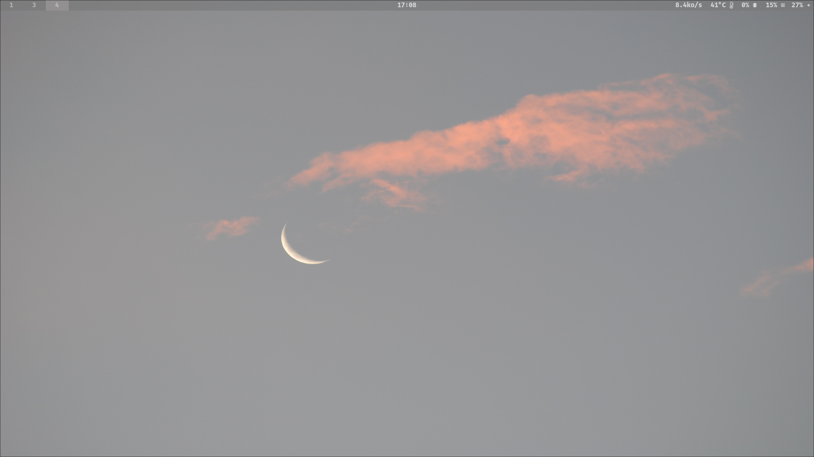
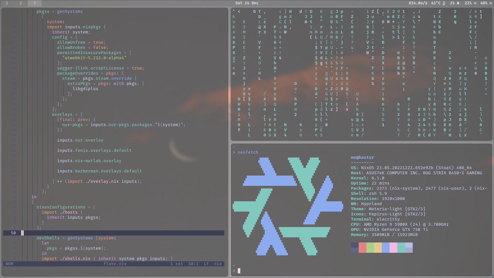

# flake + home-manager NixOS configurations

Home managing with [home-manager](https://github.com/nix-community/home-manager)  
Secrets managing with [agenix](https://github.com/ryantm/agenix)  


## Usage
__Before deployment, customizing `hardware.nix` and `network.nix`  in `./hosts/`__

You can replace hostname globally with:    
```console  
sed -i "s/hastur/YOUR_HOSTNAME/g" `rg -rl "hastur" ./`  
```

flake outputs:  

```console
> nix flake show
warning: Git tree '/etc/nixos' is dirty
git+file:///etc/nixos
├───devShells
│   ├───aarch64-linux
│   │   ├───default: development environment 'pythonEnv'
│   │   └───general: development environment 'generalEnv'
│   └───x86_64-linux
│       ├───default: development environment 'pythonEnv'
│       └───general: development environment 'generalEnv'
└───nixosConfigurations
    ├───hastur: NixOS configuration
    ├───kaambl: NixOS configuration
    └───livecd: NixOS configuration
```  

### NixOS Deployment

```console
nixos-rebuild switch --flake github:oluceps/nixos-config#<hostname>
  
```
|Type|Program|
|---|---|
|Editor|[helix](https://github.com/oluceps/nixos-config/tree/pub/home/programs/helix)|
|WM|[sway](https://github.com/oluceps/nixos-config/tree/pub/home/programs/sway)|
|Shell|[fish](https://github.com/oluceps/nixos-config/tree/pub/home/programs/fish)|
|Bar|[waybar](https://github.com/oluceps/nixos-config/tree/pub/home/programs/waybar)|
|Terminal|[wezterm](https://github.com/oluceps/nixos-config/tree/pub/home/programs/wezterm)|
|backup|[btrbk](https://github.com/oluceps/nixos-config/tree/pub/modules/btrbk)|  

_To use devShell:_  
```console
nix develop .#devShells.x86_64-linux.<shell>
```   

_To build livecd:_

```console
nix build .#nixosConfigurations.livecd.config.system.build.isoImage
```


## Contents
+ hosts: host-specific configuration  
+ home: home-manager config  
+ modules: as its name  
+ modules/packs: self-packaged softwares


## Directory structure  
```console  
> exa --tree --level=2
.
├── boot.nix
├── flake.lock
├── flake.nix
├── home
│  ├── default.nix
│  ├── home.nix
│  └── programs
├── hosts
│  ├── default.nix
│  ├── hastur
│  ├── kaambl
│  ├── livecd
│  └── shares.nix
├── LICENSE
├── misc.nix
├── modules
│  ├── blog
│  ├── clash-m
│  ├── default.nix
│  ├── foot
│  ├── hysteria
│  ├── naive
│  ├── packs
│  ├── polybar
│  ├── shadow-tls
│  ├── sing-box
│  ├── ss
│  └── tuic
├── overlay.nix
├── packages.nix
├── README.md
├── screenshot.png
├── secrets
│  ├── hyst.age
│  ├── naive.age
│  ├── secrets.nix
│  ├── sing.age
│  ├── ssconf.age
│  └── tuic.age
├── services.nix
├── shells.nix
├── sysvars.nix
└── users.nix

```  

## Screenshot  




## Resources  
Excellent configurations that I've learned and copied:  
+ [NickCao/flakes](https://github.com/NickCao/flakes)  
+ [ocfox/nixos-config](https://github.com/ocfox/nixos-config)  
+ [Clansty/flake](https://github.com/Clansty/flake)  
+ [fufexan/dotfiles](https://github.com/fufexan/dotfiles)  
+ [gvolpe/nix-config](https://github.com/gvolpe/nix-config)

[NixOS-CN-telegram](https://github.com/nixos-cn/NixOS-CN-telegram)


